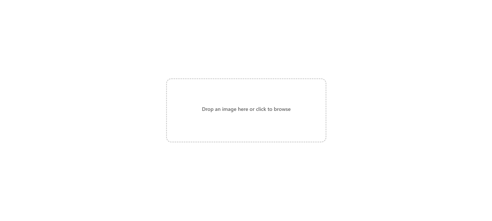

# Drag and Drop File Upload with Preview and Image Removal

A modern, interactive drag-and-drop file upload component, designed for a seamless user experience with image preview and easy removal functionality. Built using HTML, CSS, and JavaScript, it is highly responsive and perfect for web projects and applications.

## Features

- **Drag and Drop Support**: Users can drag and drop images directly into the drop zone for uploading.
- **Click to Upload**: The drop zone is clickable, allowing users to browse for images from their local system.
- **Image Preview**: Displays a preview of the selected image once it's uploaded.
- **Remove Image Option**: Users can remove the uploaded image with a single click.
- **Responsive Design**: The component adapts to different screen sizes, ensuring it works on desktops, tablets, and mobile devices.
- **User-Friendly Interface**: Intuitive and smooth UI with hover effects, transitions, and helpful hints.

## Installation

To add this file upload component to your web project:

1. Copy the HTML, CSS, and JavaScript code.
2. Paste it into your project files.
3. Customize it further according to your needs.

## Demo

